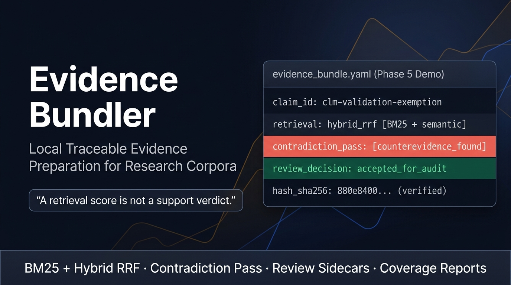

# Evidence Bundler



Evidence Bundler is a local evidence-preparation tool for research corpora. It takes a scaffolded research run, loads the bounded source set, nominates candidate passages for each claim, and writes a traceable evidence bundle that can be reviewed before it goes downstream.

I built it around a traceability rule from my pharmaceutical QA background: every claim, source, passage, review decision, and output file should be recoverable from the artifacts on disk. Retrieval is useful, but a retrieval score is not a support verdict. Evidence Bundler keeps that boundary visible.

The current implementation supports Markdown, plain text, and PDF sources. It can build BM25 and hybrid retrieval bundles, opt into parent-level reranking, nominate counter-candidates through a text-gated contradiction pass, record review decisions in sidecar files, finalize reviewed bundles, and write coverage reports that call out gaps instead of hiding them.

## What it does

Evidence Bundler starts from a contract-shaped scaffold run. The scaffold run contains extracted claims, source metadata, source content, and source passage anchors. The bundler verifies that intake before it does retrieval work.

The ingest layer turns sources into deterministic `DocumentChunk` records. Markdown and plain text use the same chunking model, while PDF extraction runs behind a unified extractor interface so loader behavior stays testable.

The retrieval layer nominates candidate passages. BM25 is the lexical baseline. Hybrid retrieval combines BM25 and semantic child rankings with reciprocal rank fusion, then can rerank parent candidates when config enables it. The contradiction pass uses separate query prefixes and a conservative text gate to nominate possible counter-candidates. Those are nominations, not counterevidence determinations.

The review and output layer keeps draft retrieval state separate from review state. `evidence-bundler review` writes a `review_annotations.yaml` sidecar. `evidence-bundler refine-excerpts` writes a separate excerpt-refinement log. `evidence-bundler finalize-bundle` reads the draft bundle plus sidecars and writes a sealed reviewed bundle. `evidence-bundler coverage-report` summarizes review counts, nomination gaps, anchor hashes, refinement conflicts, and structured inconsistencies.

## What it does not do

Evidence Bundler does not prove that a claim is true. It does not replace audit. It prepares candidate evidence, preserves provenance, and makes review state explicit so downstream tools or reviewers can inspect the path from source corpus to bundle output.

The fixture writer is only a contract-shape smoke path. It copies scaffold-cited passages into bundle shape for local contract checks. It does not retrieve candidate support, determine claim support, or turn chunks into reviewed evidence.

## Install and test

Use Python 3.11 or 3.12.

```bash
python -m venv .venv
.venv/bin/python -m pip install -e ".[dev]"
.venv/bin/ruff check src tests scripts
.venv/bin/python -m pytest
.venv/bin/python -m mypy src
.venv/bin/python -m compileall src
.venv/bin/python -m pip check
```

The full test suite currently covers intake validation, hashing, Markdown/text/PDF ingest, BM25 retrieval, hybrid retrieval, reranking, contradiction retrieval, review sidecars, finalization, coverage reporting, and the two committed demo runners.

## Try the basic fixture path

The mixed-format fixture is the smallest useful path through intake, ingest, retrieval, review, finalization, and coverage reporting.

```bash
.venv/bin/evidence-bundler verify-intake tests/fixtures/scaffold-run-mixed-formats
.venv/bin/evidence-bundler ingest tests/fixtures/scaffold-run-mixed-formats --dry-run --report-out build/ingest-report.md
.venv/bin/evidence-bundler build-bundle tests/fixtures/scaffold-run-mixed-formats --output build/evidence-bundle-bm25 --method bm25 --report-out build/bm25-report.md
.venv/bin/evidence-bundler review init build/evidence-bundle-bm25 --output build/review_annotations.yaml
.venv/bin/evidence-bundler review batch build/evidence-bundle-bm25 --annotations build/review_annotations.yaml --decision accepted --sample 1 --dry-run
.venv/bin/evidence-bundler refine-excerpts build/evidence-bundle-bm25 --annotations build/review_annotations.yaml --output build/excerpt_refinement.yaml
.venv/bin/evidence-bundler finalize-bundle build/evidence-bundle-bm25 --annotations build/review_annotations.yaml --refinement build/excerpt_refinement.yaml --output build/evidence-bundle-final
.venv/bin/evidence-bundler coverage-report build/evidence-bundle-bm25 --annotations build/review_annotations.yaml --refinement build/excerpt_refinement.yaml --final-bundle build/evidence-bundle-final --provenance build/evidence-bundle-final_finalize_provenance.yaml --markdown-out build/coverage-report.md --json-out build/coverage-report.json
```

The generated files go under `build/`, which is intentionally ignored.

## Frozen retrieval/decomposition benchmark

[`benchmarks/eb-challenge-corpus-v1/`](benchmarks/eb-challenge-corpus-v1/) is
a separately frozen synthetic benchmark for retrieval, aperture-boundary, and
claim-decomposition experiments. It is not a Contract-A/Contract-B fixture or
a production behavior change. Keep its evaluator-only `gold/` and
`decompositions/` directories outside the runtime corpus; see
[`benchmarks/README.md`](benchmarks/README.md) for the mounting boundary and
freeze receipt.

## Retrieval modes

`build-bundle --method bm25` is the default baseline. It indexes child or leaf chunks and returns parent context through max-score parent aggregation.

`build-bundle --method hybrid` combines BM25 and semantic child rankings with reciprocal rank fusion. Hybrid runs can build a transient semantic index or reuse a persisted index, depending on the config.

Reranking is config-only. Set `rerank_enabled: true` in a retrieval config to rerank parent candidates after hybrid aggregation.

Contradiction retrieval is also config-only. Set `contradiction_enabled: true` to run the contradiction pass and route text-gated counter-candidate nominations into `counterevidence_passages`.

## Demo artifacts

`examples/handoff-demo/` is a fictional BM25 handoff exercise. It exists to check that a reviewed bundle can keep provenance anchors intact when handed to a downstream audit adapter. The demo intentionally includes a `needs-review` row so partial-review state remains visible.

Run it with:

```bash
.venv/bin/python scripts/run_phase_4_unit1_handoff_demo.py --force
```

`examples/phase-5-draft/` is a real-corpus retrieval exercise built around a pinned FDA CGMP quality systems guidance PDF and fictional claims. The runner downloads the FDA PDF, verifies its SHA-256 hash, builds a runtime scaffold, runs hybrid retrieval with rerank and contradiction retrieval, applies a deterministic review sequence, finalizes a bundle, writes coverage reports, and records ADR-010 / ADR-011 measurements.

Run it with:

```bash
.venv/bin/python scripts/run_phase_5_fda_guidance_demo.py --force
```

The latest verified FDA exercise on 2026-06-17 produced zero coverage inconsistencies, included 8 final reviewed claims, wrote 13 final evidence passages, set `reviewer_sign_off.required` to `true`, preserved expected counter-claim coverage across the runnable ADR-010 measurement set, and left only the intentionally invalid rerank-off / contradiction-rerank-on matrix cell as non-completed. The demo remains a measurement artifact: it records retrieval behavior and review state rather than presenting retrieval nominations as support verdicts.

## External Project Configuration

The demo and workflow scripts support explicit path configuration and discovery of external dependencies like **Claim Audit Lab** (CAL) and **Apparatus Contracts** (vocabulary specifications).

### 1. Claim Audit Lab (CAL) Discovery
When running CAL-related workflows (e.g., `run_phase_4_unit1_handoff_demo.py` or `claim_appendix_workflow.py`), the CAL root is discovered using the following precedence:
1. Explicit CLI argument: `--claim-audit-root <PATH>`
2. Environment variable: `CLAIM_AUDIT_LAB_ROOT`
3. Sibling folder named `claim-audit-lab` under the same parent MainFrame directory.
4. Legacy sibling folder pathing.

If CAL is not found at any of these locations, a clear `FileNotFoundError` listing the attempted paths is raised.

### 2. Apparatus Contracts / Vocabulary Discovery
Cross-repository tests (like `tests/test_hashing.py`) check the embedded vocabulary against canonical copies using `APPARATUS_CONTRACTS_ROOT`.
- Set the `APPARATUS_CONTRACTS_ROOT` environment variable to the root of the `apparatus-contracts` repository.
- If the environment variable is not set, it attempts to resolve the sibling `apparatus-contracts` directory under the same parent MainFrame directory.
- If no canonical copy is found, the test gracefully skips via `pytest.skip` instead of raising a hard failure.

### 3. Claim Appendix PDF Resolution
For `scripts/claim_appendix_workflow.py`, the input PDF path is resolved as:
1. Positional CLI path argument.
2. Environment variable: `CLAIM_APPENDIX_PDF`.
3. If neither is provided, it raises a `FileNotFoundError`.
